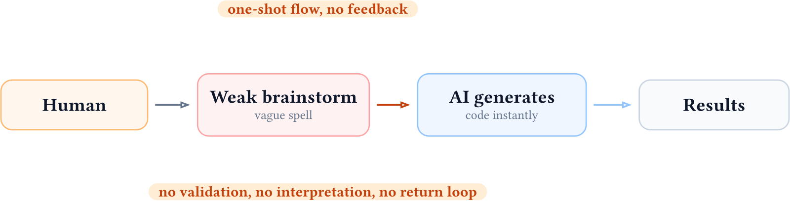

この章では、AI を使ってコードを書く際の**良いやり方**と**悪いやり方**を区別する。焦点は、AI とどう協力して設計し、実装し、レビューし、必要なら前段に戻るかという**技術的な進め方**にある。

## Vibe coding と Agentic development

### 悪い AI 開発（素の Vibe coding）

**Vibe coding** とは、自然言語で AI に指示してコードを書かせるスタイル全般を指す。そのなかでも、**曖昧な spell のまま AI に一方向に渡し、結果を十分に検証しないやり方**は悪い AI 開発である。

{fig-alt="Human から Weak brainstorm / vague spell を経て、AI generates code instantly、Results へ一方向に進む図" width="100%"}

- その場しのぎの指示になりやすい
- プロジェクトの前提が AI に十分伝わらない
- 結果の検証が弱く、人間のレビューが追いつかない

結果として、AI がテストを書き換えて通してしまう、同じ前提を何度も説明し直す、といった問題が起きやすい。

### 良い AI 開発（Agentic development）

**Agentic development** とは、AI を単なるコード生成器ではなく**開発エージェント**として扱い、設計・実装・レビューを往復しながら進める開発スタイルである。

{fig-alt="BS session の枠の中に Human、AI、Write plan があり、design feedback loop と、Review (human + AI agent) から BS session へ戻る results feedback loop が描かれた図" width="100%"}

- **BS session**  
  実装の前に、何を解きたいか・制約は何か・どう検証するかを人間と AI で揃える。
- **Review = human + AI agent**  
  実行結果やレビュー結果は、人間の目だけでなく AI と協力して読み解き、必要なら設計や計画に戻る。
- **Tests / CI**  
  生成されたコードの正しさは、テストと CI で機械的に担保する。

規模が大きくなるほど、前提・方針・約束事を `AGENTS.md` や設計ドキュメント・issue に書き出し、人間と AI が同じ「記憶」を参照できるようにすることも重要になる。

この章の役割は、講義の各 Step で AI とどう協力するかの最低限の型を共有することである。

## 対比の要点

- 悪い AI 開発は、`Human -> AI -> Results` の一方通行になりやすい
- 良い AI 開発は、`BS session -> Execute -> Review (human + AI agent) -> BS session` のループを持つ
- 良い AI 開発では、レビューの速さと正しさをテスト・CI で支える

## ツールと用途・規模の関係

### エディタ型は論文・プレゼン向き

Cursor や VS Code Copilot などの**エディタ型**では、人間がファイルを開き、編集箇所を選び、AI の提案をその場で取り入れるか決める。つまり**全体のコンテキストを人間が握っている**。

論文やプレゼンでは、論の流れやトーンを自分で決めたいし、最終的に**自分が発表する**ので全体の一貫性を人間が管理したい。そのため、エディタ型が向く。

### 小規模なら人間が全体を管理、大規模なら AI に任せる

- **小規模なコード**（スクリプト、論文用コード、プレゼン資料）  
  人間が**全体を把握・管理できる**し、したい。エディタ型でよい。

- **大規模なコード**（ライブラリ、多数ファイル、長期保守するプロジェクト）  
  人間が**原理的に全体を頭に入れて管理するのは無理**である。自律型（Claude Code, Codex CLI など）に任せ、設計・方針は `AGENTS.md` や設計ドキュメントで外部化して共有するのが現実的である。

ただし、規模にかかわらず、実行結果やレビュー結果を **human + AI agent** で解釈し、必要なら `BS session` に戻るループそのものは共通して重要である。

この講義の Step では主に小〜中規模のコードを扱うが、そこで身につける「実行 spell と説明 spell の分離」「結果の検証」といった習慣は、大規模な Agentic development の土台になる。

参考: CompPhysHack 2026 講義資料 <https://qc-hybrid.github.io/CompPhysHack2026/>。とくに Jin-Guo Liu, "Vibe coding done right" (2026-03-07) <https://qc-hybrid.github.io/CompPhysHack2026/slides/vibecoding-JinGuoLiu.pdf>。
